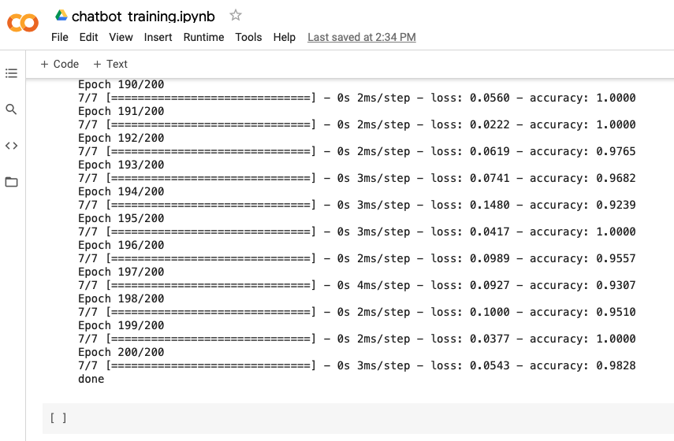
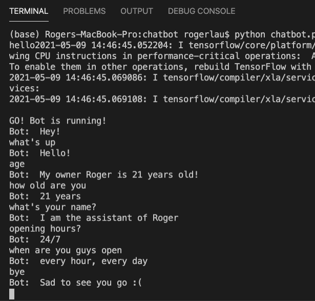

# AI Chatbot
### Description:
An intelligent AI chatbot using Neural Networks and Natural Language Processing (NLP) in Python.
The chatbot learns how to answer questions corresponding to the training dataset where intents and sample questions and answers are provided.

### Application:
The application for this chatbot could be used for handling customers' FAQs where even there is no specific keyword shown, the chatbot could answer with correct intent. Compared with traditional approach in which keywords must appear in the question so as to search for specific intent, this chatbot is more intelligent and time-saving.

### Accuracy:
Achieved an accuracy of *98%* for the trained model.

### Explanation:
The chatbot firstly read the question raised from tester,  
and tokenize the text,  
lemmatize each word,  
then predict the intent with the trained model,  
lastly iterate the intent list and randomly choose a proper response from the answers list.  
Output the response.   

